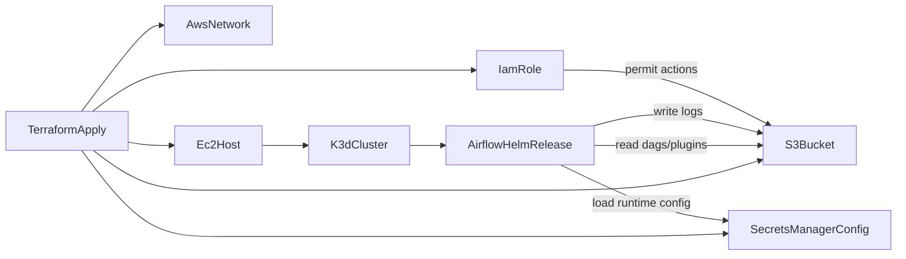

# IaC architecture: EC2 + k3d + Airflow

## Components

- **Network**
  - VPC (`vpc_cidr`)
  - Public subnet (`public_subnet_cidr`)
  - Internet Gateway + public route table
  - Security Group: inbound only `22/tcp` from `allowed_ssh_cidr`
- **Compute**
  - Ubuntu EC2 instance
  - Docker + k3d cluster (`1 server + 3 agents`)
- **Storage**
  - Shared S3 bucket with prefixes:
    - `dags/`
    - `logs/`
    - `plugins/`
    - `config/` (optional values file override)
  - Block public access enabled
  - Versioning enabled
  - Lifecycle expiration for `logs/`
- **Access**
  - IAM instance role with:
    - `AmazonSSMManagedInstanceCore`
    - inline S3 policy scoped to required bucket/prefixes
  - Secrets Manager secret with runtime config keys:
    - `airflow_log_bucket`
    - `aws_region`
    - `airflow_remote_base_log_uri`
    - `airflow_fernet_key`
    - `airflow_webserver_secret_key`
    - `airflow_statsd_host`
    - `airflow_alert_webhook_url`
    - `airflow_alert_email_to`

## Data flow

## Required variables

- `allowed_ssh_cidr`
- `ssh_public_key`

## Recommended variables

- `instance_type = "t3.large"` for cheap test
- `s3_bucket_name_override` if you need deterministic bucket naming
- `s3_logs_expiration_days` for log retention policy

## Apply sequence

1. Fill `infra/terraform/terraform.tfvars`
2. `terraform init && terraform plan && terraform apply`
3. SSH into EC2 and verify `kubectl get nodes`
4. Deploy Airflow with `infra/scripts/post_bootstrap_deploy_airflow.sh`
5. Validate S3 logging under `s3://<bucket>/logs/`
