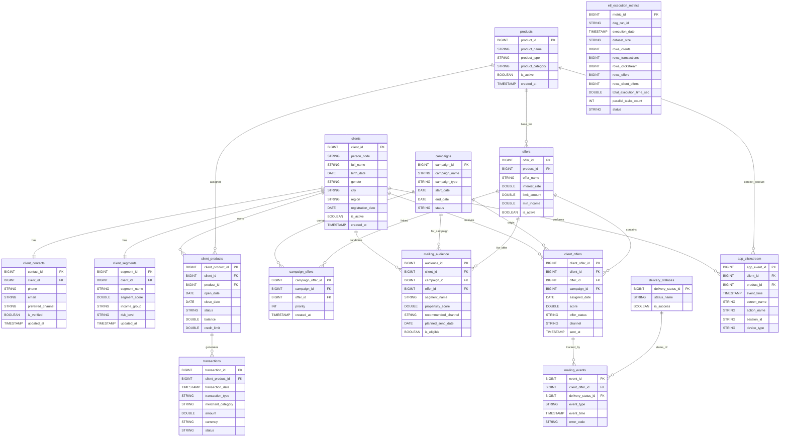

# Bank Data ER Schema

```mermaid
erDiagram
    clients {
        BIGINT client_id PK
        STRING person_code
        STRING full_name
        DATE birth_date
        STRING gender
        STRING city
        STRING region
        DATE registration_date
        BOOLEAN is_active
        TIMESTAMP created_at
    }

    client_contacts {
        BIGINT contact_id PK
        BIGINT client_id FK
        STRING phone
        STRING email
        STRING preferred_channel
        BOOLEAN is_verified
        TIMESTAMP updated_at
    }

    client_segments {
        BIGINT segment_id PK
        BIGINT client_id FK
        STRING segment_name
        DOUBLE segment_score
        STRING income_group
        STRING risk_level
        TIMESTAMP updated_at
    }

    products {
        BIGINT product_id PK
        STRING product_name
        STRING product_type
        STRING product_category
        BOOLEAN is_active
        TIMESTAMP created_at
    }

    client_products {
        BIGINT client_product_id PK
        BIGINT client_id FK
        BIGINT product_id FK
        DATE open_date
        DATE close_date
        STRING status
        DOUBLE balance
        DOUBLE credit_limit
    }

    transactions {
        BIGINT transaction_id PK
        BIGINT client_product_id FK
        TIMESTAMP transaction_date
        STRING transaction_type
        STRING merchant_category
        DOUBLE amount
        STRING currency
        STRING status
    }

    campaigns {
        BIGINT campaign_id PK
        STRING campaign_name
        STRING campaign_type
        DATE start_date
        DATE end_date
        STRING status
    }

    offers {
        BIGINT offer_id PK
        BIGINT product_id FK
        STRING offer_name
        DOUBLE interest_rate
        DOUBLE limit_amount
        DOUBLE min_income
        BOOLEAN is_active
    }

    campaign_offers {
        BIGINT campaign_offer_id PK
        BIGINT campaign_id FK
        BIGINT offer_id FK
        INT priority
        TIMESTAMP created_at
    }

    mailing_audience {
        BIGINT audience_id PK
        BIGINT client_id FK
        BIGINT campaign_id FK
        BIGINT offer_id FK
        STRING segment_name
        DOUBLE propensity_score
        STRING recommended_channel
        DATE planned_send_date
        BOOLEAN is_eligible
    }

    client_offers {
        BIGINT client_offer_id PK
        BIGINT client_id FK
        BIGINT offer_id FK
        BIGINT campaign_id FK
        DATE assigned_date
        DOUBLE score
        STRING offer_status
        STRING channel
        TIMESTAMP sent_at
    }

    delivery_statuses {
        BIGINT delivery_status_id PK
        STRING status_name
        BOOLEAN is_success
    }

    mailing_events {
        BIGINT event_id PK
        BIGINT client_offer_id FK
        BIGINT delivery_status_id FK
        STRING event_type
        TIMESTAMP event_time
        STRING error_code
    }

    app_clickstream {
        BIGINT app_event_id PK
        BIGINT client_id FK
        BIGINT product_id FK
        TIMESTAMP event_time
        STRING screen_name
        STRING action_name
        STRING session_id
        STRING device_type
    }

    etl_execution_metrics {
        BIGINT metric_id PK
        STRING dag_run_id
        TIMESTAMP execution_date
        STRING dataset_size
        BIGINT rows_clients
        BIGINT rows_transactions
        BIGINT rows_clickstream
        BIGINT rows_offers
        BIGINT rows_client_offers
        DOUBLE total_execution_time_sec
        INT parallel_tasks_count
        STRING status
    }

    clients ||--|| client_contacts : has
    clients ||--|| client_segments : has
    clients ||--o{ client_products : owns
    products ||--o{ client_products : assigned
    client_products ||--o{ transactions : generates

    products ||--o{ offers : base_for
    campaigns ||--o{ campaign_offers : contains
    offers ||--o{ campaign_offers : linked

    clients ||--o{ mailing_audience : candidate
    campaigns ||--o{ mailing_audience : for_campaign
    offers ||--o{ mailing_audience : for_offer

    clients ||--o{ client_offers : receives
    campaigns ||--o{ client_offers : origin
    offers ||--o{ client_offers : contains

    client_offers ||--o{ mailing_events : tracked_by
    delivery_statuses ||--o{ mailing_events : status_of

    clients ||--o{ app_clickstream : performs
    products ||--o{ app_clickstream : context_product
```

